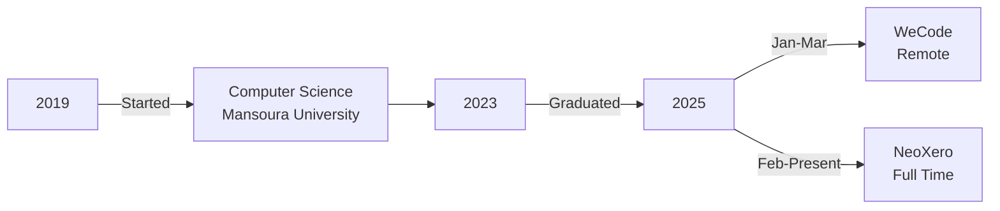

<!-- Hero Section -->


<h2 align="center">Front-End Developer | React.js • Next.js • TypeScript</h2>

<p align="center">
  
</p>

<!-- Social Links - Prominent Position -->
<p align="center">
  <a href="https://a7mdmo74.vercel.app" target="_blank">
    
  </a>
  <a href="https://www.linkedin.com/in/a7mdmo74" target="_blank">
    
  </a>
  <a href="mailto:a7mdmo74@gmail.com">
    
  </a>
  <a href="https://github.com/a7mdmo74" target="_blank">
    
  </a>
</p>

<p align="center">
  
  
  
</p>

---

## 👨‍💻 About Me

Hi, I'm **Ahmed Muhammad**, a passionate **Front-End Developer** with **3+ years** of experience building modern, scalable, and user-friendly web applications.

**What defines me as a developer:**

🚀 **Performance-Oriented** – I care deeply about speed, SEO, and accessibility  
🎨 **UI/UX Focused** – I design and implement interfaces that feel smooth and intuitive  
🤝 **Collaborative** – I enjoy working with backend teams, designers, and product managers  
🌍 **Global Mindset** – Built platforms for **football clubs, eCommerce, and real estate** used by international users

I believe in **clean code, scalability, and delightful experiences** that users remember.

```javascript
const ahmed = {
  location: "Cairo, Egypt",
  languages: ["Arabic (Native)", "English (B2)"],
  currentFocus: ["Next.js 15", "TypeScript", "Performance Optimization"],
  askMeAbout: ["React", "Next.js", "Frontend Architecture", "UI/UX"],
  funFact: "I turn coffee into responsive web apps ☕️"
};
```

---

## 🛠 Tech Stack

<p align="center">
  
  
  
</p>

### ⚡ Languages & Frameworks


### 🎨 Styling & UI


### 🗄️ Databases & APIs


### ⚙️ Tools & Platforms


---

## 💼 Professional Experience

### 🏢 Front-End Developer @ **NeoXero**
*Feb 2025 – Present | Full Time*
- 🚀 Built dynamic web applications using **React.js** and **Next.js**
- 🔍 Enhanced **SEO practices** and optimized performance metrics
- 🤝 Collaborated with backend teams to integrate **RESTful APIs**

### 🌐 Front-End Developer @ **WeCode** (Remote)
*Jan 2025 – Mar 2025 | Part Time*
- ⚡ Developed React/Next.js applications focusing on **performance optimization**
- ♿ Ensured **responsive design**, **accessibility**, and **scalability**
- ✅ Contributed to successful project outcomes with clean, maintainable code

---

## 🚀 Featured Projects

<table>
  <tr>
    <td width="50%">
      <h3 align="center">🏠 Makanly</h3>
      <p align="center">
        <a href="https://www.makanly.com/" target="_blank">
          
        </a>
      </p>
      <p><strong>Stack:</strong> Next.js, React, TypeScript, Tailwind CSS</p>
      <p>✨ Developed a <strong>real estate platform</strong> with responsive UI and scalable architecture</p>
      <p>🔍 Implemented SEO best practices and optimized performance</p>
    </td>
    <td width="50%">
      <h3 align="center">🛒 Al Nassr SC Store</h3>
      <p align="center">
        <a href="https://store.alnassr.sa/" target="_blank">
          
        </a>
      </p>
      <p><strong>Stack:</strong> React, Tailwind CSS, REST APIs</p>
      <p>⚽ Built the official <strong>multilingual eCommerce platform</strong> for Al-Nassr football club</p>
      <p>🌍 Delivered a responsive shopping experience for <strong>global fans</strong></p>
    </td>
  </tr>
  <tr>
    <td width="50%">
      <h3 align="center">💡 Lighting Address</h3>
      <p align="center">
        <a href="https://lightingaddress.com/" target="_blank">
          
        </a>
      </p>
      <p><strong>Stack:</strong> React, Tailwind CSS, REST APIs</p>
      <p>🏪 Designed a modern eCommerce experience for a lighting products company</p>
      <p>⚡ Focused on <strong>fast load times</strong> and <strong>mobile-first design</strong></p>
    </td>
    <td width="50%">
      <h3 align="center">🛍️ Al Emar International</h3>
      <p align="center">
        <a href="https://shop.al-emar.com/" target="_blank">
          
        </a>
      </p>
      <p><strong>Stack:</strong> React, Tailwind CSS, REST APIs</p>
      <p>🚿 Developed the front-end for an advanced finishing and sanitary products store</p>
      <p>🎯 Created a <strong>clean product showcase</strong> with smooth navigation</p>
    </td>
  </tr>
</table>

---

## 📊 GitHub Analytics

<p align="center">
  
  
</p>

<p align="center">
  
</p>

<p align="center">
  
</p>

---

## 🎓 Certifications & Education

**🎓 Education**
- Bachelor of Computer Science, **Mansoura University** (2019–2023)

**📜 Certifications**
- ✅ Next.js 15 & React - The Complete Guide | Udemy (2023)
- ✅ React Certification | Udemy (2023)
- ✅ Front End Development Libraries | freeCodeCamp (2022)
- ✅ JavaScript Algorithms and Data Structures | freeCodeCamp (2022)
- ✅ Responsive Web Design | freeCodeCamp (2021)

---

## 📈 Career Timeline



---

## 🌟 What I'm Up To

- 🔭 Currently working on **Next.js 15** projects with advanced **Server Components**
- 🌱 Learning **Three.js** for 3D web experiences
- 👯 Looking to collaborate on **open source React/Next.js projects**
- 💬 Ask me about **React, Next.js, TypeScript, Performance Optimization**
- 📫 Reach me: **a7mdmo74@gmail.com**
- ⚡ Fun fact: **I debug with console.log() and I'm not ashamed!** 😄

---

## 📬 Let's Connect & Collaborate!

<p align="center">
  <a href="https://a7mdmo74.vercel.app" target="_blank">
    
  </a>
</p>

<p align="center">
  <a href="https://www.linkedin.com/in/a7mdmo74" target="_blank">
    
  </a>
  <a href="mailto:a7mdmo74@gmail.com">
    
  </a>
  <a href="https://github.com/a7mdmo74" target="_blank">
    
  </a>
</p>

---

<p align="center">
  <i>⭐️ If you like my work, consider giving my repos a star! It means a lot! ⭐️</i>
</p>


